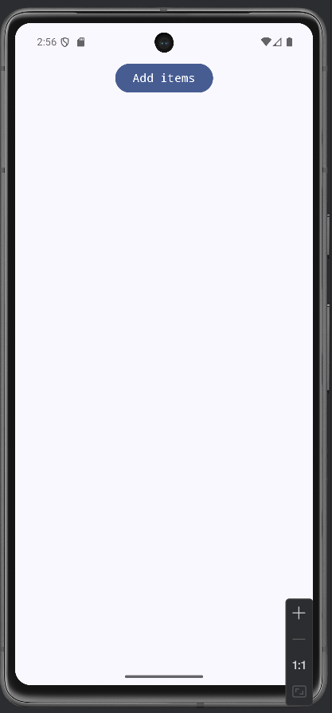
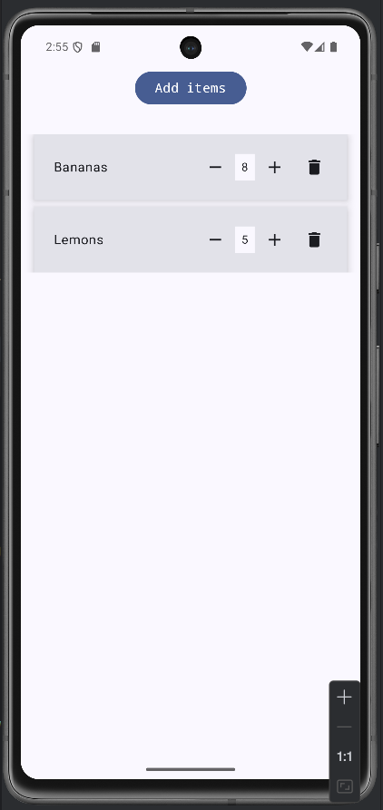

## 📱 Shopping List Demo App

A simple Android app that allows users to create a list of items and simultaneously edit or delete each one. Built by following a video tutorial and adding personal touches to optimize the reference code. The project emphasizes learning and experimentation, with all logic currently housed in `HomeItemCard.kt`.

---

### 🚀 Features

- Add items to a shopping list
- Edit item details inline
- Delete items instantly
- Real-time UI updates using Jetpack Compose
- Lightweight and beginner-friendly architecture

---

### 🛠️ Tech Stack

| Tool / Library                | Purpose                             |
|-------------------------------|-------------------------------------|
| Kotlin                        | Core programming language           |
| Jetpack Compose               | Declarative UI framework            |
| Android Studio                | Development environment             |
| `mutableStateOf` + `remember` | State management within composables |

---

### 📸 Screenshots

<figure>
  <figcaption><strong>Main Screen</strong></figcaption>
  
</figure>
<figure>
  <figcaption><strong>Filled Add Item Alert</strong></figcaption>
  
</figure>
<figure>
  <figcaption><strong>Added item message</strong></figcaption>
  
</figure>
<figure>
  <figcaption><strong>Adding an already existing item</strong></figcaption>
  
</figure>
<figure>
  <figcaption><strong>Existing item quantity update</strong></figcaption>
  
</figure>
<figure>
  <figcaption><strong>Items list</strong></figcaption>
  
</figure>
<figure>
  <figcaption><strong>Editing an existing item</strong></figcaption>
  
</figure>
<figure>
  <figcaption><strong>Updated list with edited item</strong></figcaption>
  
</figure>
<figure>
  <figcaption><strong>Deleting an item</strong></figcaption>
  
</figure>

---

### 📦 Installation

```cmd
git clone https://github.com/gavri1990/ShoppingListDemoApp
```

Open the project in **Android Studio**, build, and run on an emulator or device.

---

### 🧪 Status

This project is a learning sandbox and not yet production-ready. All logic is centralized in `HomeItemCard.kt` for simplicity and experimentation.

---

### 🙌 Acknowledgments

- Jetpack Compose documentation
- Kotlin community for helpful resources
